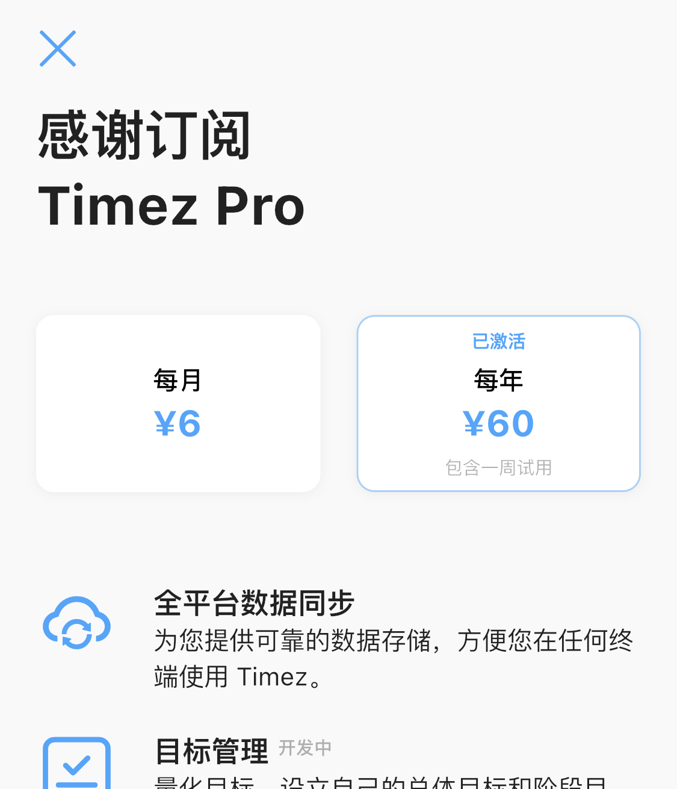

# Timez 全平台数据同步上线

> 曾和老婆讨论人生的意义。我说：此生的意义就是帮助更多的人提升自己的效率。

因为想要做一款效率软件，所以 Timez 从新建文件夹开始，树立的目标就是**全平台应用**。一开始，一切计划都在向全平台靠拢。

从最开始的技术选型选定 Flutter 开始，到 Android 和 iOS 双端上线、再到 Windows 和 MacOS 上线。直到今天，数据同步功能上线，Timez 才终于磕磕绊绊的向全平台真正的迈出了第一步。

目前的 Timez 已经可以在 Android、iOS、Windows 和 MacOS 上良好的运行了。并且所有平台的数据都会实时同步，双机党和上班党已经可以有比较好的使用体验了。

不过由于全平台数据同步需要持续的服务器费用支出，所以推出了 Timez PRO 会员，数据同步需要付费后才能使用。目前的定价是**一月 6 元**，**一年 60 元**，如果订阅年付则会有**一周试用**时间，**试用期内不收费**。

> 在**今天（2021/11/22）之前**赞赏过的用户，请将您的注册邮箱和赞赏渠道（微信、支付宝或公众号）和付款账户名发送到 **1@fxcdev.com**，或者是**公众号后台**。您将获得一年的 Timez PRO 会员。如果没有联系，将会使用您赞赏时留下的邮箱作为账号激活。

# 遗憾

抱歉的是，因为精力不足，无法同时维护两套数据同步，所以将 iCloud 同步下线了。所以这个版本对于 iPhone 和 Mac 用户来说是体验倒退的一个版本。不过下一个版本马上上线另一个期待已久的功能：目标管理。

# 下一步计划

目前 Timez 的短板很明显，规划功能很弱，事后总结功能也很弱。所以接下来的开发计划会是这样子：

* 首先开发**目标管理**功能，同时优化目前交互不合理的地方。解决当前无法追踪任务进度的问题

* **番茄钟**和**白噪音**功能，让记录功能更加实用

* 规划功能，解决 Timez 的一大短板

* 更多的统计项

* 重新设计效率分体系

至于 Linux 平台和 Watch 平台，目前对于我来说是有心无力，因为自己对于这两个平台十分的不熟悉，需要较大的精力投入，所以优先级会比较低。

# 声明

Timez 不会收集任何用户隐私，用户保存在服务器上的数据仅用作设备间数据同步之用，不会用于其他任何用途。后面也会推出账号注销功能，账号注销后会删除服务器上所有该账号的数据。

# 最后

因为这个版本涉及到数据同步，所以投入了大量的精力在服务器开发、数据推送稳定性以及数据安全上面，导致更新比较慢。之后会重新将精力投入在客户端开发中，会加快更新速度，会同时保障 Pro 用户和普通用户的体验。

谢谢支持
