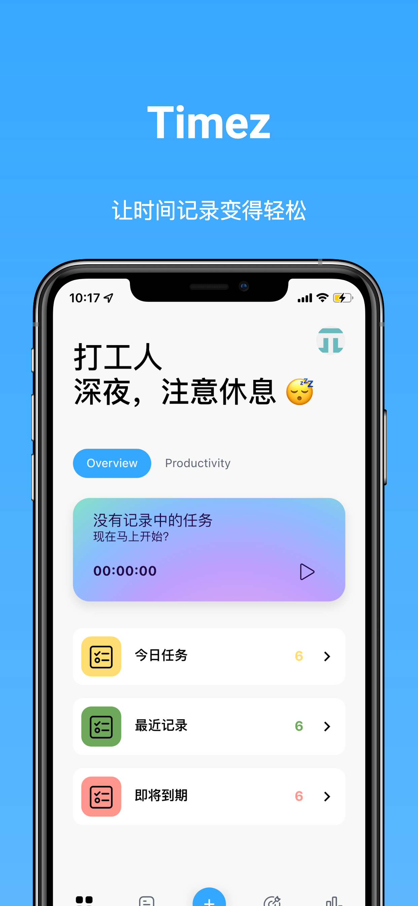
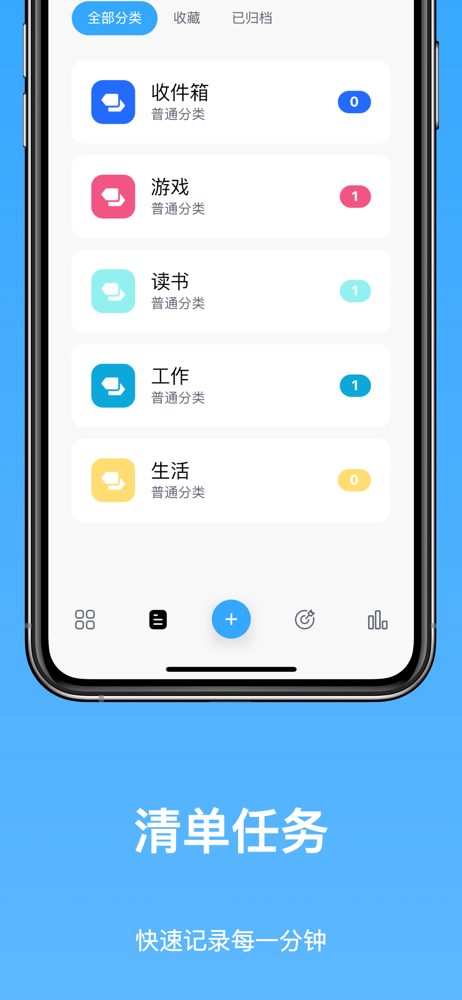
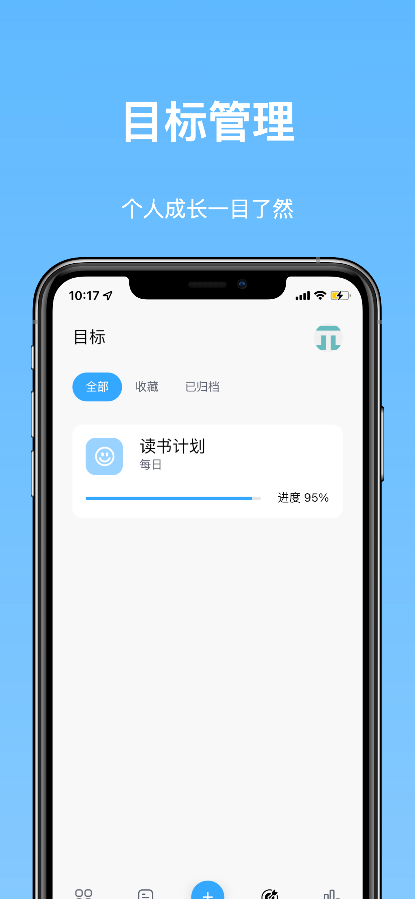
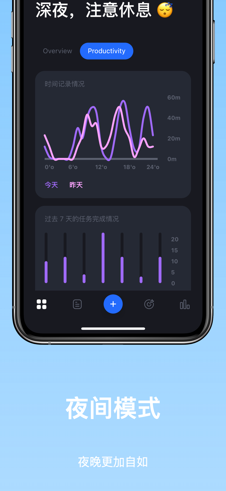
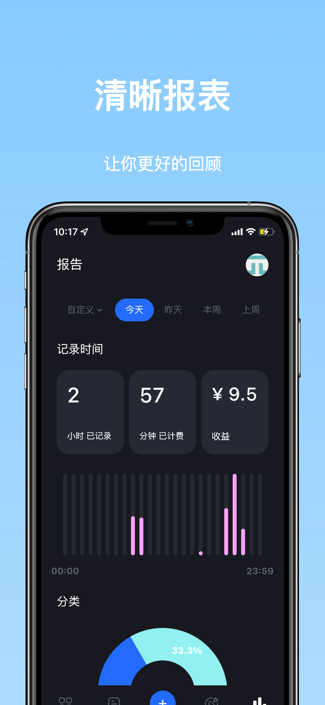

> 赶在 2021 年的尾巴，Timez 2.0 赶鸭子上架一样上架了。不然开发周期太长，把自己都要整疯了。

# 2.0 更新

## 界面重新设计

Timez 2.0 重新设计了交互和界面，加入了夜间模式的适配。

之所以重新设计，是因为之前的界面再想要添加功能，让人感觉无从下手，似乎入口添加在哪里都有点怪怪的。

<,,,,>

## 云同步免费开放

现在免费账户也可享用数据云同步功能。

## 目标管理功能上线

目标管理是我一直心心念念的功能，目前已经将大致框架实现了。接下来会进一步填充目标管理的功能。

# 其他

## 服务器已经拒绝 2.0 版本以下访问

因为 Timez 2.0 从底层到界面全都大变样了，所以目前只做了旧版本数据升级新版本。二者之间的互通暂时没做，所以服务器直接拒绝了 2.0 以下的访问。

## 拖动排序马上搞定

拖动排序昨晚已经写完 demo 了，马上会发布

## 其他功能

番茄钟、搜索、白噪音在路上了
