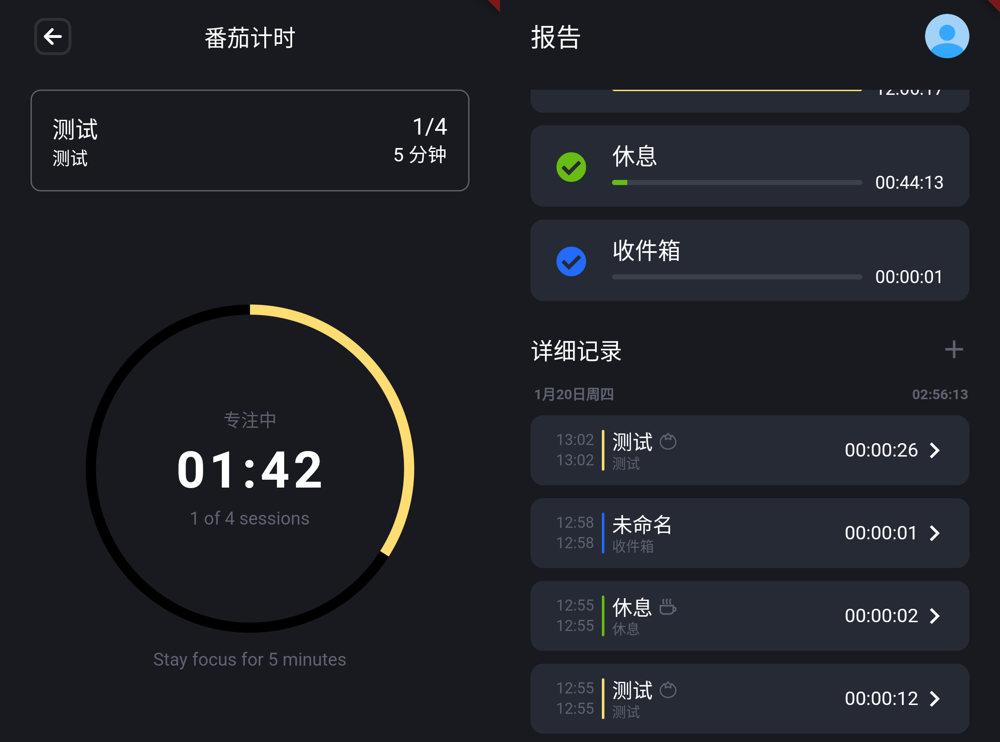

> Timez 现已支持番茄钟！[点击下载](https://timezapp.top/docs/download) 

# 关于更新

Timez 2.2.0 版本更新内容如下：

- 新增番茄钟支持
- 修复若干 Bug

# 关于番茄钟

以下内容来自[维基百科](https://zh.wikipedia.org/wiki/%E7%95%AA%E8%8C%84%E5%B7%A5%E4%BD%9C%E6%B3%95 "维基百科")

## 步骤

番茄工作法有五个步骤：

- 决定需要先完成的任务
- 设定番茄工作法定时器至 n 分钟（通常为 25 分钟）。
- 持续工作直至定时器提示,记下一个番茄。
- 短暂休息 3-5 分钟。
- 每四个番茄，休息 15-30 分。

## 原理

番茄工作法的关键是**规划，追踪，记录，处理，以及可视化**。在规划阶段，任务被根据优先级排入"To Do Today" list。 这允许用户预计每个任务的工作量。当每个**番茄时**结束后，成果会被记录下来以提高参与者的成就感并为未来的自我观察和改进提供原始数据。

**番茄时**意指每个工作时段的时长。当任务完成后，所有番茄计时器剩下的时间会被用于过度学习。短休息时间可以辅助达到心理学上的同化作用，3-5 分钟的短休息间隔开每个番茄工作时段。四个番茄工作时组成一组。一个 15-50 分钟的长休息间隔开每组作业。

这一时间管理技术的本质目的是**减少内生和外在的干扰对意识流的影响**。一个单位的番茄工作时不可再细分。当在番茄工作时中被打断的情况下，只可能有两种情况：干扰的活动被推迟（告知 - 协商 - 安排日程 - 回访），或者当前的番茄工作时废弃，必须重新开始。

# 谈谈 Timez 与番茄钟

如果需要番茄钟功能，需要在对应**分类**的设置中开启。

每个分类有单独的番茄钟配置，用户可以根据场景实践合适的番茄工作法。

## 休息任务

Timez 的番茄钟与其他软件的区别在于有**休息任务**的概念。因为 Timez 的实际目标是记录时间，所以会要求用户配置休息任务，番茄钟休息的时间会被记录为此任务。

当前也可以不配置**休息任务**，只是这样休息时的时间将不会被记录。

## 优化空间

Timez 目前在**规划**和**可视化**方面的能力有所欠缺，在**追踪**、**记录**和**处理**上目前表现尚可。

下一步会推出**自动规划**、**预估时间**等功能来提升时间规划能力。还会有**更丰富、高度可定制统计内容**帮助用户回顾时间使用情况。

# 即将推出

- 搜索
- 倒计时计时
- 白噪音
- 时间轴
- 更多小部件

